# Village provençal — plugin Unreal Engine 5

Un village provençal complet de **4 × 4 km**, construit sur le **plan réel de Roussillon (Vaucluse)** : les rues, les ruelles, les places et l'emplacement de chaque bâtiment viennent des cartes ouvertes (OpenStreetMap via Overture Maps), et le relief vient du modèle de terrain européen Copernicus.

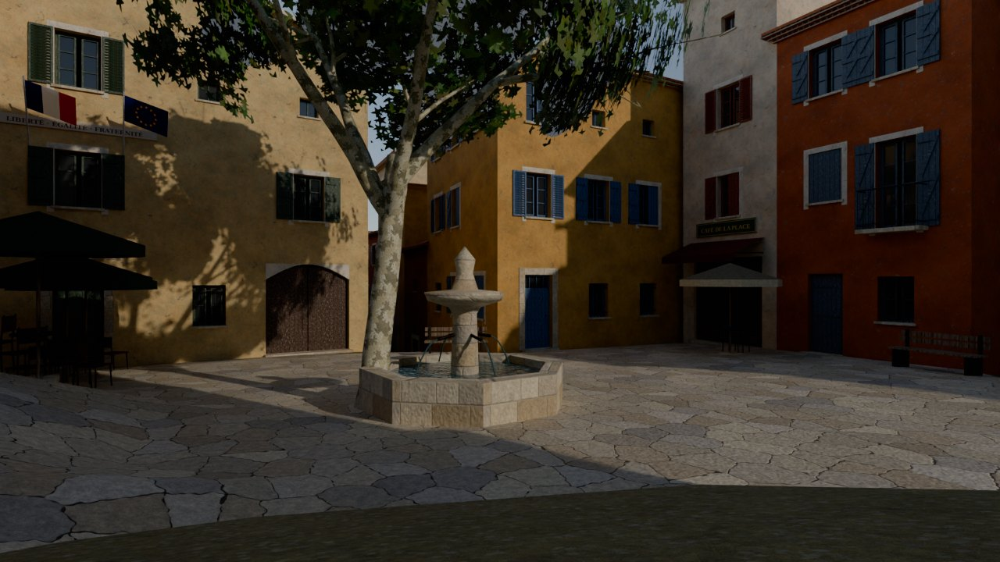

| | |
| --- | --- |
| 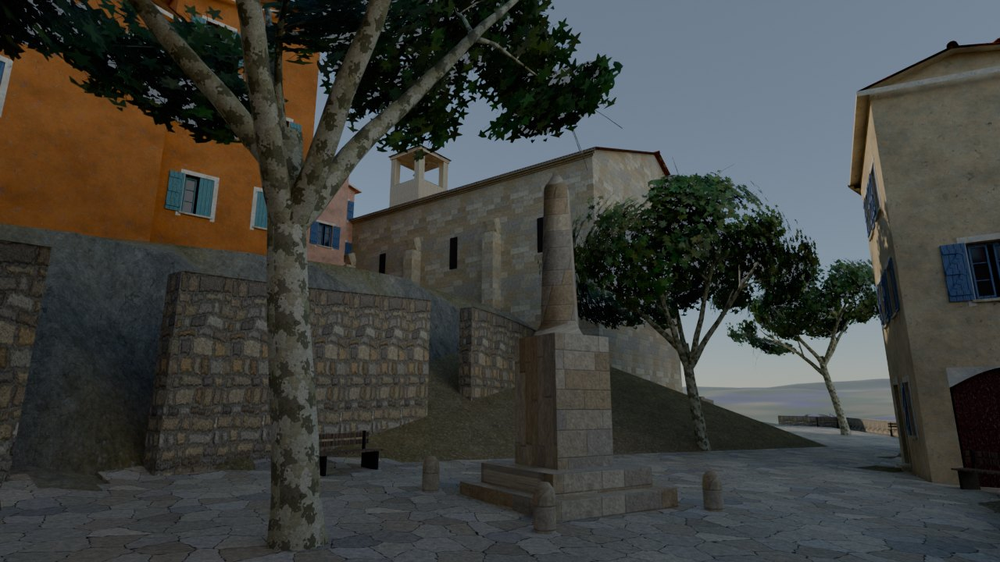 | 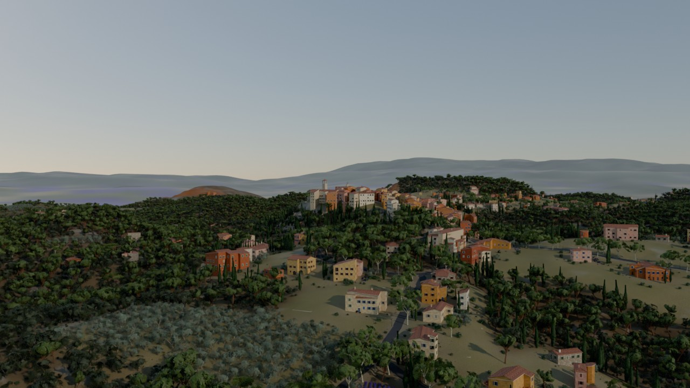 |
| 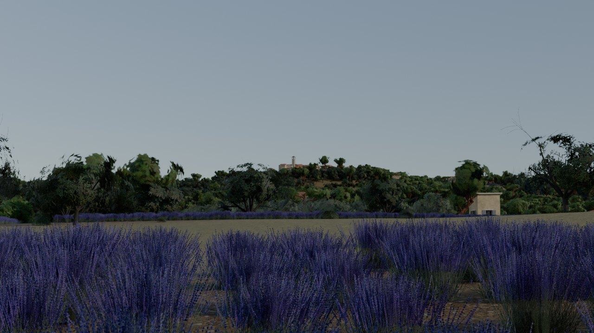 | 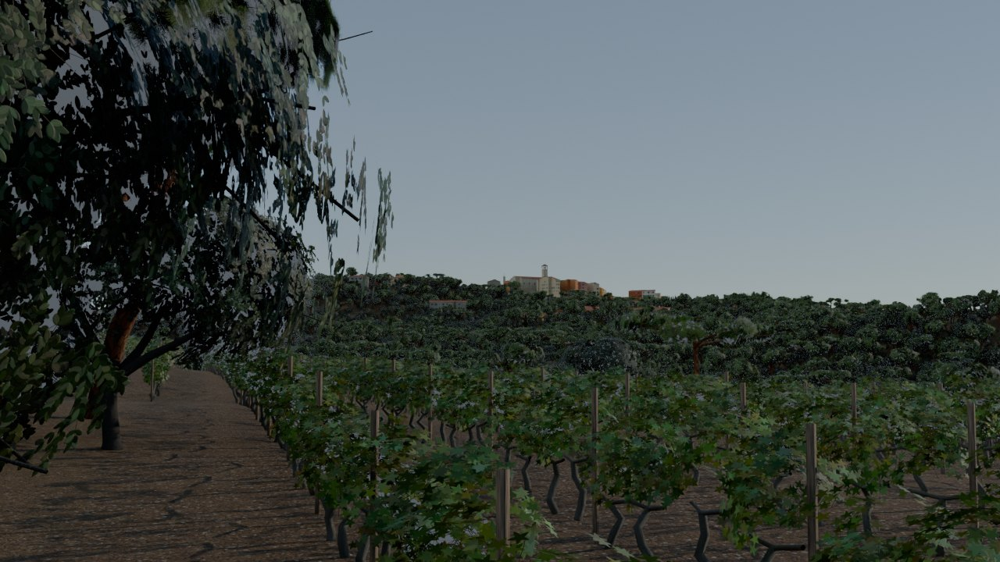 |

*Aperçus calculés avec Blender Cycles à partir des mêmes données que le plugin. Dans Unreal, avec Lumen, le rendu sera différent.*

## Contenu

| | |
| --- | --- |
| **Bâtiments** | 1 949 bâtiments : maisons de village, mas, villas, remises, auvents. Chaque maison est générée avec ses fenêtres, volets provençaux (à écharpe en Z, persiennes, ouverts, fermés), génoise sous le toit, tuiles canal, cheminées, remises voûtées, balcons en fer forgé, jardinières et pots de fleurs. Environ 21 000 fenêtres et 2 200 portes. |
| **Monuments** | Église Saint-Michel avec clocher et cloche, beffroi avec horloge et campanile en fer forgé, mairie avec drapeaux, plaque « MAIRIE » et devise, monument aux morts, deux fontaines. |
| **Commerces** | Placés à l'emplacement des commerces réels (noms inventés) : cafés et restaurants avec terrasses et parasols, boulangerie, coiffeur, pharmacie avec croix verte, épicerie, bar-tabac avec sa carotte, galeries, savons de Provence, santons, cave à vins, hôtel, poste. |
| **Rues** | Calades de galets dans le vieux village, places dallées en terrasse avec murs de soutènement, routes goudronnées avec lignes blanches, chemins, escaliers, 47 plaques de rue émaillées aux vrais noms (rue de l'Église, rue des Bourgades…), panneaux d'entrée « ROUSSILLON », panneaux directionnels, 223 réverbères, lanternes murales, bancs. |
| **Quartier des Ocres** | Le village s'étend sur tout le côté nord-est de la coulée d'ocre : 362 maisons de village mitoyennes (même style que le vieux village : façades ocre, tuiles, génoises, volets), le long de 4 rues parallèles au bord de l'ocre et de ruelles transversales en calade. Une rue principale goudronnée le relie au réseau, et une placette plantée de platanes se trouve au carrefour central. Plus de 80 de ces maisons se visitent. |
| **Ceinture du village** | Tout autour du village, une mer de **lavande sur environ 500 m** (1 048 parcelles aux rangs orientés différemment, 188 ha), parsemée d'environ 800 **oliviers** (seuls ou par deux ou trois) et quelques centaines de **cyprès** (isolés ou en courts alignements ; les haies brise-vent y ont été retirées). Seuls **10 mas** isolés y sont gardés, chacun avec son jardin (pelouse, oliviers, cyprès, lauriers-roses). Au-delà, une **forêt dense** de pins et de chênes verts sur 600 m (425 ha), avec un sous-bois de garrigue. Les falaises et coulées d'**ocre** restent à nu. |
| **Nature** | Environ 900 000 plantes : pinèdes et chênes verts, garrigue, 167 000 segments de rangs de vigne, champs de lavande en rangs, oliveraies, vergers, haies de cyprès contre le mistral, allée de platanes à l'entrée du village, pins parasols, lauriers-roses, balles de foin sur les champs moissonnés, 269 piscines de mas. Le feuillage bouge avec le vent. |
| **Terrain** | Relief réel (village perché à 330 m, vallée à 180 m), falaises d'ocre du sentier des Ocres, 8 types de sol (garrigue sèche, terre labourée, ocre, roche, sous-bois, herbe, chemin, chaume). À l'horizon : le Luberon, les monts de Vaucluse et le **mont Ventoux**. |
| **Ambiance** | Soleil de fin d'après-midi, ciel et atmosphère physiques, nuages volumétriques, brume, Lumen. Sons en boucle : **chant des cigales**, **fontaines** et **vent**. |
| **Vent et passage** | Arbres, herbes, lavande, vigne et buissons bougent avec le mistral et ses rafales, et s'écartent au passage du joueur et des personnages IA. |
| **Zombies** | Village abandonné : voitures, barricades, inscriptions, sang, camp de survivants ; 1 235 points d'apparition ; volume de navigation. |
| **Intérieurs** | 135 bâtiments visitables : 105 maisons (à étage, de plain-pied, sur 3 niveaux avec colimaçon), 28 commerces, la mairie et l'église ; 8 ambiances ; portes qui s'ouvrent. |
| **Parkour** | Planches entre les toits, échelles, échafaudages, caisses, balcons praticables. |

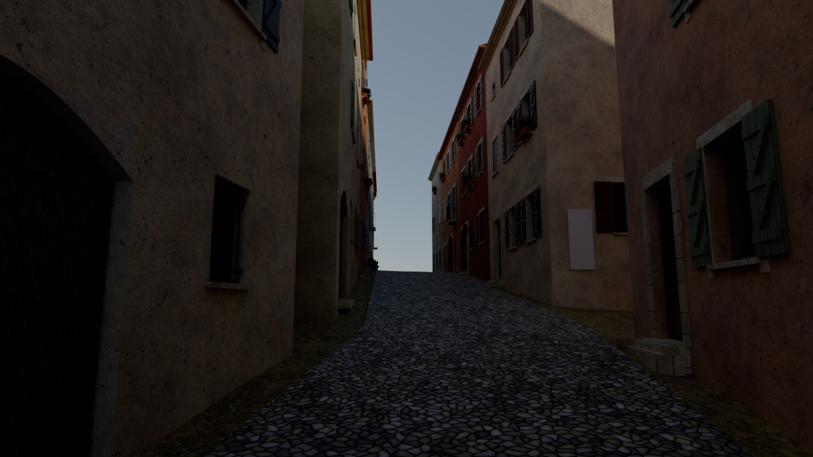

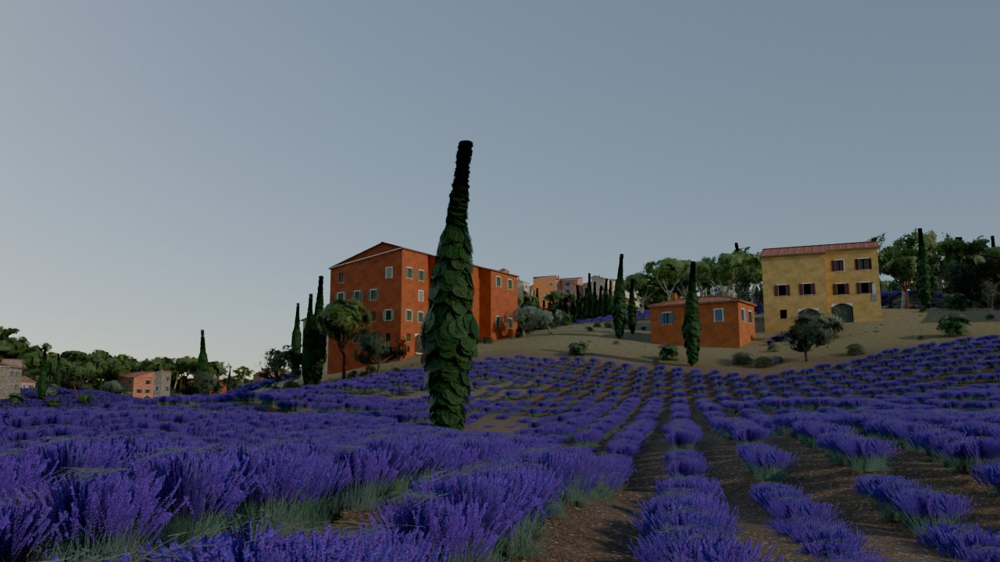

Tout est généré : aucune texture, aucun modèle ni aucun son n'a été copié d'Internet. Les textures (pierre, enduit à la chaux, tuiles canal, calade…) ont été calculées pour ce projet.

## 1. Installer le plugin

1. Copie le dossier `Plugins/VillageProvence` (avec son sous-dossier `Data`, 132 Mo) dans le dossier `Plugins` de ton projet, à côté de `TMMouvements`.
2. Ouvre le projet. Unreal propose de compiler le nouveau module : réponds **Oui**. Il faut Visual Studio 2022 avec « Développement Desktop en C++ », comme pour l'autre plugin.
3. Vérifie dans **Edit > Plugins** que « Village provençal (Roussillon) » est coché.

Version conseillée : Unreal Engine 5.3 ou plus récent. Nanite et Lumen doivent être actifs, ce qui est le réglage par défaut des projets UE5.

## 2. Construire le village

1. Crée un niveau vide : **File > New Level > Empty Open World**, ou **Empty Level** si ton jeu n'utilise pas World Partition.
2. Menu **Tools > Village provençal > Construire le village provençal**.
3. Attends la fin : une barre de progression s'affiche. Compte 10 à 30 minutes selon le PC, puis encore quelques minutes de compilation des shaders.
4. Enregistre le niveau (**Ctrl+S**). Les assets sont déjà enregistrés dans `Content/VillageProvence`.

Le plugin crée :

- `Content/VillageProvence/Textures`, `Materials` et `Meshes` : 112 textures, 7 matériaux maîtres avec leurs instances, les maillages Nanite du bâti, du terrain et de la voirie, les arbres avec 3 niveaux de détail.
- Dans le niveau, un dossier **VillageProvence** : Terrain, Bati, Voirie, Mobilier, Monuments, Vegetation, Details, Ambiance, Sons.

Les autres commandes du même menu :

- **Replacer le village (sans recréer les assets)** : place le village dans un autre niveau en réutilisant les assets, en quelques minutes.
- **Retirer le village du niveau** : supprime les acteurs du village. Les assets restent dans le Content Browser.

## 3. Jouer dans le village

- Un **Player Start** est placé sur la place de la mairie, devant la fontaine. Il n'est créé que si le niveau n'en a pas déjà un.
- Dans **World Settings**, choisis le **GameMode** de ton jeu pour jouer avec ton personnage.
- Le village est à l'échelle réelle (1 unité = 1 cm). Les toits, les murs et le terrain ont des collisions exactes : tu peux marcher dans les ruelles et **courir sur les toits** avec le plugin TMMouvements. Les troncs d'arbres, les réverbères et les bancs bloquent aussi le joueur. Les herbes, la lavande et la vigne se traversent.
- La lumière, le ciel, la brume et le Post Process ne sont ajoutés que s'ils manquent : ceux de ton niveau ne sont pas modifiés.

## 4. Un village envahi par les zombies

| | |
| --- | --- |
| 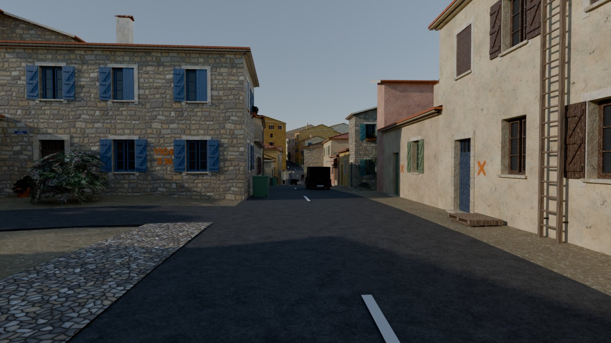 | 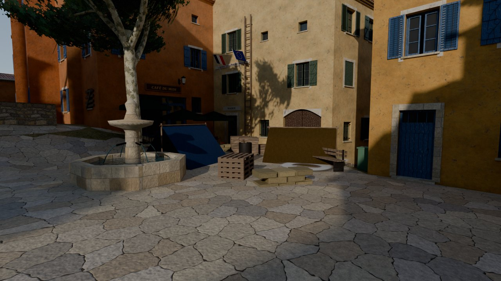 |

Le village garde son style provençal, mais il a été abandonné dans l'urgence :

- **Rues** : 300 voitures abandonnées (citadines, berlines, fourgonnettes, épaves brûlées), dont certaines en travers de la route. Un barrage de police bloque la route principale à l'entrée du village. Il y a aussi des sacs-poubelle, des poubelles renversées, des palettes, des caisses, des pneus, des gravats et des terrasses de café renversées.
- **Façades** : 550 fenêtres et portes condamnées par des planches, des croix de fouille peintes à côté des portes, de la suie au-dessus des fenêtres incendiées, des impacts de balles. Environ 100 inscriptions à la bombe : « ZONE INFECTÉE », « NE PAS ENTRER », « ILS SONT DEDANS », « SURVIVANTS → MAIRIE », « PAS DE BRUIT »…
- **Sang** : 450 traces au sol dans les rues, sur les places et dans les maisons.
- **Camp de survivants** sur la place de la mairie : cercle de sacs de sable, bâches, brasero, caisses, matelas et « SOS » peint au sol.

### Faire apparaître les zombies

La construction place l'acteur **VP_PointsApparition** (dossier `VillageProvence/Zombies`). Il contient 1 235 points d'apparition (rues, places, champs autour du village, maisons visitables) et la liste des maisons visitables.

Dans ton mode de jeu (Blueprint ou C++) :

1. **Get VP Points Apparition** (nœud statique) donne l'acteur.
2. **Get Points Autour** (Centre = position du joueur, Distance Min, Distance Max, Nombre, Regard = direction de la caméra) renvoie des points hors de la vue du joueur.
3. Fais apparaître un zombie sur chaque point.

En C++ :

```cpp
if (AVPPointsApparition* Points = AVPPointsApparition::Get(this))
{
    const FVector Regard = Joueur->GetControlRotation().Vector();
    for (const FVector& P : Points->GetPointsAutour(Joueur->GetActorLocation(), 2500.f, 6000.f, 4, Regard))
    {
        GetWorld()->SpawnActor<ATMZombie>(ATMZombie::StaticClass(), P + FVector(0, 0, 100), FRotator::ZeroRotator);
    }
}
```

Le bouton **Afficher** de l'acteur montre les points dans l'éditeur. Un **Nav Mesh Bounds Volume** de 1,6 × 1,6 km est aussi créé autour du village, pour les IA qui se déplacent avec le navmesh. Appuie sur **P** dans l'éditeur pour voir le navmesh. Il couvre les rues, les places, les maisons visitables et les toits praticables.

## 5. Bâtiments visitables

| | |
| --- | --- |
| 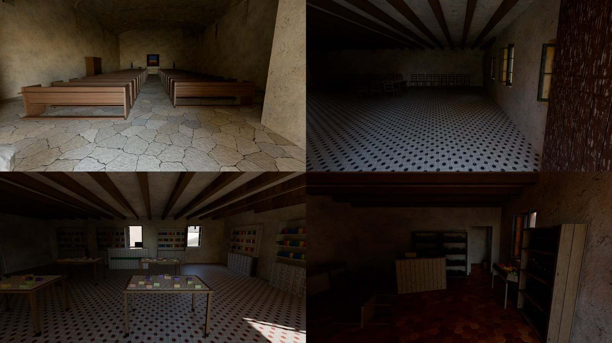 | 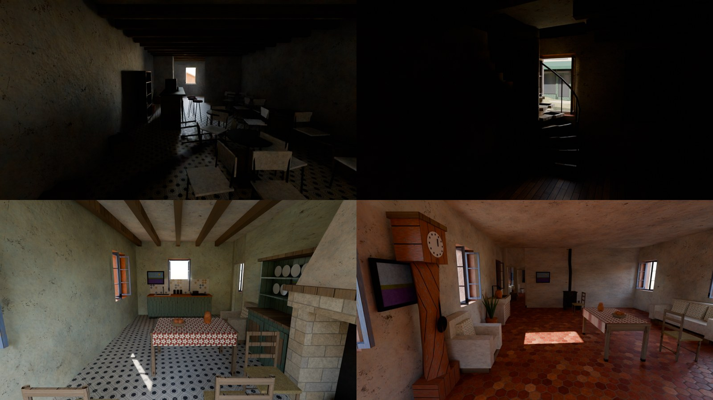 |

220 bâtiments du village s'ouvrent. On entre par la porte (elle s'ouvre toute seule quand le joueur approche), ou par une fenêtre en parkour : les fenêtres des niveaux aménagés sont ouvertes, sans vitre.

| Type | Nombre | Plan |
| --- | --- | --- |
| Maison à étage | 55 | rez-de-chaussée en deux pièces, escalier droit le long d'un mur, étage avec salle de bain et chambre ; la cuisine est tantôt au fond, tantôt du côté de l'escalier |
| Maison sur 3 niveaux | 6 | comme la maison à étage, plus un **escalier en colimaçon** dans la chambre qui monte à un **grenier** encombré (malles, cartons, vieux meubles) ou à une chambre d'amis |
| Maison de plain-pied | 44 | mas et villas (et quelques maisons trop courtes pour un escalier : seul le rez-de-chaussée s'ouvre) : trois pièces en enfilade séparées par des cloisons (séjour-cuisine, chambre, salle de bain) |
| Commerce | 28 | rez-de-chaussée ouvert, porte vitrée mobile, souvent une arrière-boutique ; aménagement selon l'enseigne (voir plus bas) |
| Mairie | 1 | salle du conseil et des mariages : drapeaux, grande table, chaises, armoires d'archives |
| Église | 1 | portail à deux battants, nef voûtée avec arcs de pierre, 19 rangées de bancs, autel et retable, chandeliers, statues, lutrin, confessionnal, bénitier, vitraux |

**Commerces** : boulangerie (comptoir-vitrine, étagères à pain, four et pétrin dans l'arrière-boutique), café (comptoir en zinc, tabourets, tables de bistrot), restaurant (tables nappées), glacier, épicerie (rayonnages, cagettes de fruits, caisse), cave à vins (casiers, tonneaux), pharmacie (rayons blancs, comptoir), coiffeur (fauteuils et miroirs), galeries et boutiques de santons, poteries et savons (présentoirs), accueil (office de tourisme, poste, hôtel). La moitié des commerces ont été pillés (marchandises renversées, cartons, traces de sang).

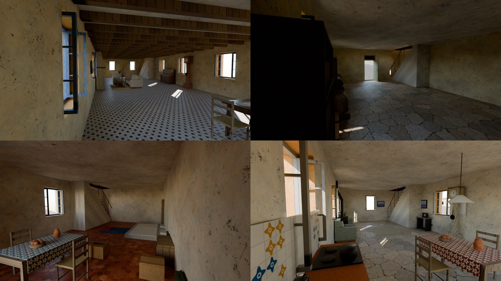

**Neuf ambiances pour les maisons**, tirées au hasard (les villas penchent vers la maison bourgeoise, les mas vers la salle commune et l'atelier) :

| Ambiance | Rez-de-chaussée | Étage |
| --- | --- | --- |
| Classique | cuisine équipée, table et chaises paillées ; séjour avec cheminée, canapé, bibliothèque | chambre des parents |
| Salle commune | une seule grande pièce : grande table, évier en pierre, pétrin, horloge comtoise, bocaux | chambre des parents |
| Bourgeoise | salle à manger (table en noyer, 6 chaises, vaisselier) ; salon avec piano, horloge, lampadaire, tableaux | chambre des parents |
| Atelier | établi, outils, tonneaux, casier à bouteilles, cartons, malle | petite chambre avec bureau |
| Grand-mère | cuisine, poêle à bois, fauteuils, machine à coudre, horloge, plantes, cadres | chambre avec malle et fauteuil |
| Famille | comme la classique, avec des plantes | chambre d'enfants (deux lits, bureau, coffre) |
| Refuge de survivants | réchaud, conserves, jerricans, matelas et sacs de couchage au sol | dortoir |
| Saccagée | meubles déplacés, chaises renversées, cartons, traces de sang | chambre des parents |
| Moderne (maison rénovée) | béton ciré ou parquet clair, murs peints lisses ; cuisine laquée avec îlot et tabourets, canapé d'angle face à la télévision, lampe arc, étagère à cases, tableaux abstraits | lit plateforme, dressing, bureau avec ordinateur ; douche à l'italienne et vasque |

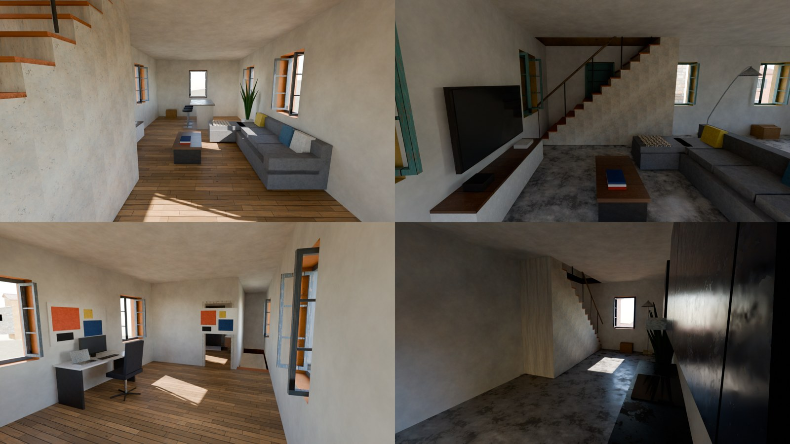

**Décor différent d'une maison à l'autre** : sol en tomettes, carreaux de ciment (motif de couleur différente), dallage de pierre ou parquet ; murs blanc cassé, ocre, rose, bleu, vert ou gris ; poutres foncées, naturelles ou blanchies (ou plafond lisse) ; frise de la faïence de la salle de bain.

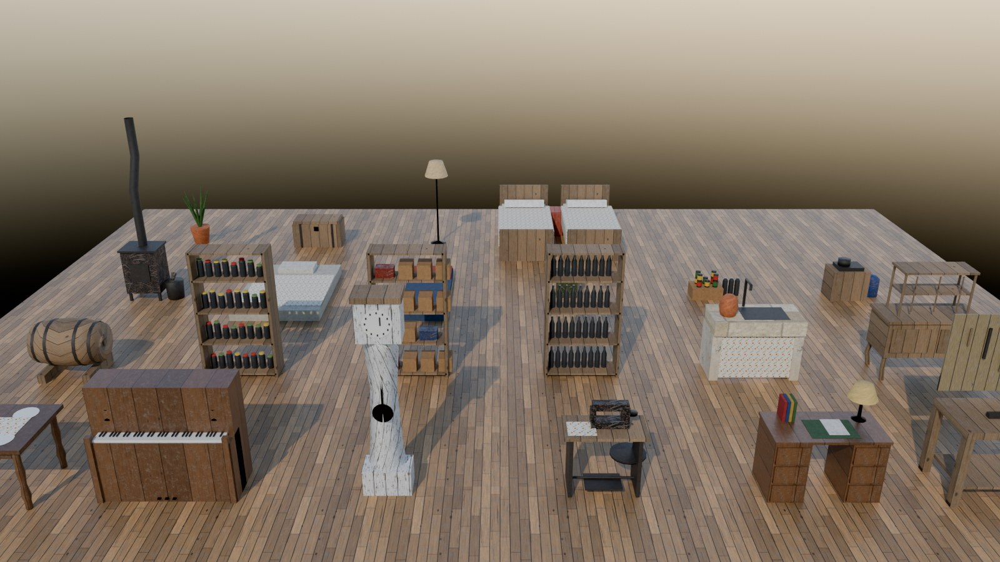

### Escaliers

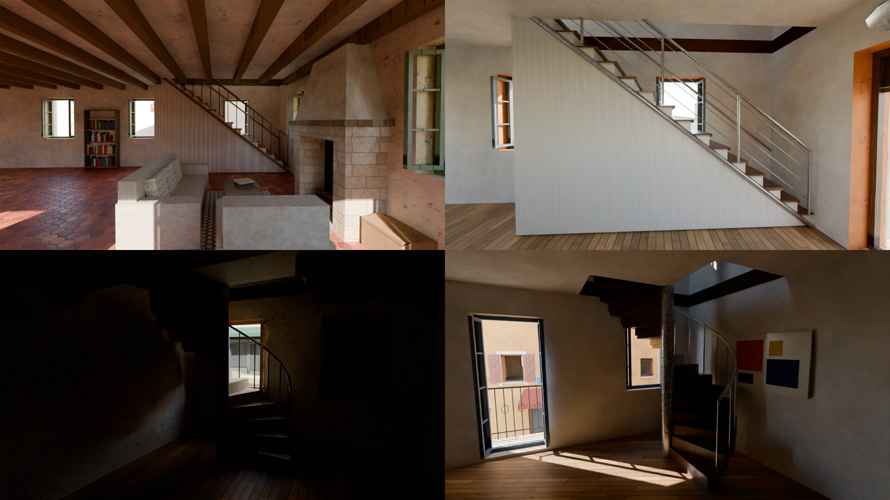

- **Escalier droit** : 1,05 m de large, marches de 19 cm pour 25 cm de giron ; girons en terre cuite avec nez de marche en bois, limon, balustres et main courante côté vide. La première marche est à 0,9 m du mur du fond (0,6 ou 0,4 m dans les maisons courtes) : ce palier de départ permet d'arriver face à l'escalier au lieu de le trouver collé au mur. Aucun escalier n'est collé au mur : une maison trop courte pour un palier d'au moins 0,4 m s'ouvre de plain-pied (étages fermés). Avec un palier de 0,4 m, les 4 premières marches restent sans garde-corps pour pouvoir aussi y monter par le côté. Dans les maisons à 3 niveaux, l'escalier droit est placé de façon à laisser la place au colimaçon.
- **Colimaçon** (maisons sur 3 niveaux) : 2,2 m de diamètre, marches pleines en éventail (pierre ou bois), noyau central, garde-corps à barreaux ; le quart de tour restant sert d'accès en bas et de palier en haut, protégé par une rambarde.
- **Placement** : la volée va de préférence contre un mur sans fenêtre (et opposé à la porte d'entrée). Quand ce n'est pas possible, la fenêtre du rez-de-chaussée qui se trouve derrière est condamnée : volets fermés vus de dehors, mur plein dedans, l'escalier ne la coupe plus en biais.

- **Accessibles** : le départ (le palier et un passage de 1,3 m pour y accéder depuis la pièce) et l'arrivée (le couloir jusqu'à la chambre) de chaque escalier sont réservés : aucun meuble dessus. Chaque volée porte une **rampe de collision invisible** (dossier `VillageProvence/Escaliers`, étiquette `VP_RampeEscalier`) : seuls les personnages la touchent (canal Pawn), ils montent sans buter sur les marches, et le navmesh la suit, donc les zombies peuvent monter à l'étage. Les projectiles et la caméra la traversent.

### Portes (acteur VP_Porte)

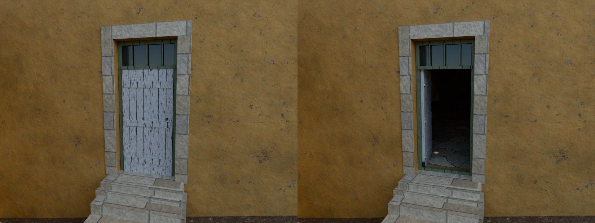

Chaque bâtiment visitable a une vraie porte (acteur **AVPPorte**, dossier `VillageProvence/Portes`) : battant en bois des maisons, porte vitrée des commerces, portail à deux battants de l'église.

- elle s'ouvre vers l'intérieur quand le joueur s'approche (**Ouverture Auto**), avec un grincement ; elle ne se referme pas toute seule sauf si **Fermeture Auto** est cochée ;
- pour ouvrir ou fermer avec une touche : dans le Blueprint du personnage, sur la touche **E**, appelle **Basculer Porte Proche** (Qui = Self) ;
- **Ouverture Par IA** : les zombies ouvrent aussi les portes (décoché par défaut, donc une porte fermée les arrête) ;
- **Verrouillée** : la porte ne s'ouvre plus (maison barricadée, objectif) ; fonctions **Ouvrir**, **Fermer**, **Basculer**, **Est Ouverte**, **Définir État** ;
- pendant le mouvement, le vantail ne bloque pas le joueur (on ne reste pas coincé), et le navmesh traverse l'embrasure.

Les portes des maisons saccagées et quelques autres sont ouvertes au départ. La position de chaque maison est aussi dans `VP_PointsApparition → Maisons Visitables` : tu peux y cacher du butin ou des zombies. Les intérieurs ne sont éclairés que par les fenêtres : ils sont sombres (les greniers n'ont presque pas de fenêtres), et une lampe torche fait son effet.

## 6. Parkour

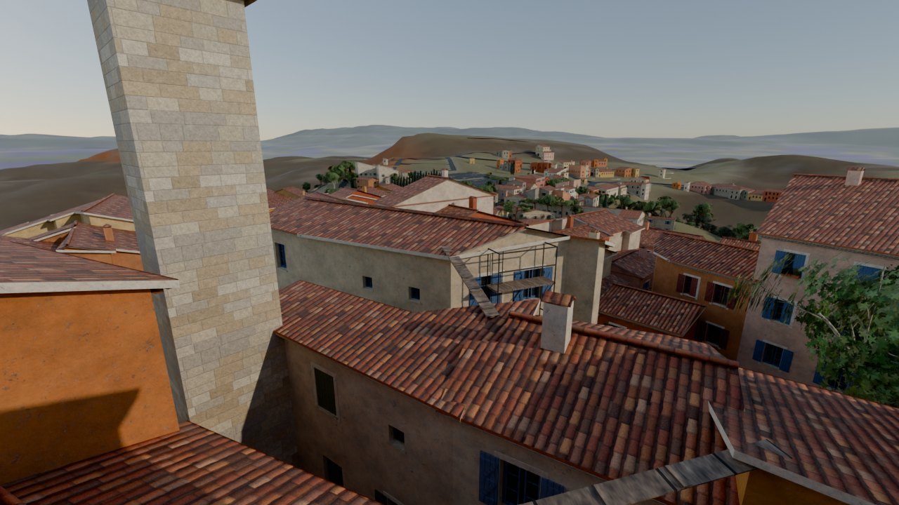

Ajoute le composant **TM Parkour** du plugin TMMouvements à ton personnage (voir son README). Il sert à se hisser, franchir des obstacles et monter aux échelles. Le village offre des parcours de toit en toit :

- **30 passages entre les toits** : planches posées au-dessus des ruelles, ou inclinées quand les deux toits ne sont pas à la même hauteur.
- **30 échelles** fixées aux façades, jusqu'au bord du toit.
- **6 échafaudages** sur les façades du vieux village, avec échelle intérieure et planchers tous les deux mètres.
- **25 départs** : caisses, piles de palettes et bennes contre des remises ou des garages bas, pour grimper sur leur toit.
- **Balcons** en fer forgé praticables, voitures et sacs de sable à franchir en courant.

Tous les toits en tuiles ont des collisions exactes et une pente douce (15 à 18°) : on y court sans glisser.

## 7. Vent et végétation vivante

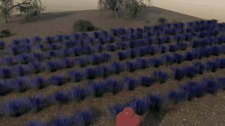

Toute la végétation bouge, sans aucun réglage à faire :

- **Le vent** : les arbres plient et se balancent (le tronc, les branches et les feuilles ensemble), les feuilles frémissent, et des vagues traversent les champs de lavande et les herbes. Les rafales balaient le paysage dans le sens du vent. Par défaut, un mistral léger souffle du nord-nord-ouest.
- **Le passage des personnages** : les herbes, la lavande, les buissons, la vigne et les branches basses s'écartent autour du joueur **et de tous les personnages IA** (tous les pions), puis se relèvent doucement derrière eux. En courant, on couche les plantes plus largement. En sautant par-dessus, on ne les touche pas.
- **Les sons** : un souffle de vent qui suit les rafales, et un froissement quand le joueur traverse les herbes, la lavande ou les buissons.

### Régler le vent

Sélectionne l'acteur **VP_Vent** dans le dossier `VillageProvence/Ambiance` (la flèche bleue montre où le vent pousse) :

| Réglage | Effet |
| --- | --- |
| Direction Degres | D'où vient le vent : 330 = mistral (nord-nord-ouest), 180 = vent du sud |
| Force | 0 = calme plat, 0,4 = brise, 1 = mistral fort, 1,5 = tempête |
| Rafales | 0 = vent régulier, 1 = très irrégulier |
| Rayon Passage | Taille de la zone écartée autour d'un personnage (0 = selon sa capsule) |
| Temps Redressement | Temps que mettent les plantes à se relever |
| Son du vent, Froissements | Volume ou désactivation des sons |

**Depuis le jeu** (Blueprint ou C++), par exemple pour la météo de ton IA : **Get VPVegetationSubsystem** puis **Set Vent** (direction, force, rafales). **Get Force Vent Actuelle** donne la force du moment, rafales comprises.

### Personnaliser par plante

- Dans chaque instance de matériau de feuillage (`MI_Lavande`, `MI_HerbeSeche`, `MI_FeuillesChene`…) : **Souplesse** (0 à 1, écartement au passage), **Ondulation** (cm, vagues du vent), **Frisson** (cm, frémissement des feuilles), **Flexibilite** (flexion du tronc, à garder identique entre l'écorce et le feuillage d'une même espèce).
- Pour régler un personnage en particulier, ajoute-lui le composant **Interaction végétation (village)** : rayon, force, ou désactivation (utile pour un fantôme ou un drone). Il permet aussi de faire écarter les plantes par un acteur qui n'est pas un pion (véhicule, ballon…).

Le mouvement est calculé par la carte graphique : il ne coûte presque rien, même avec 900 000 plantes. Au-delà de 60 à 90 m, les petites plantes arrêtent de bouger pour économiser des performances ; les arbres bougent à toutes les distances.

## Performances

La zone est grande et très détaillée. Si ton PC peine :

- Dans `VillageProvence/Vegetation`, cache ou supprime quelques acteurs `VP_Vegetation_x_y` éloignés : chacun couvre environ 1 km².
- Réduis les distances d'affichage des herbes et buissons : sélectionne un composant dans l'acteur, puis règle **Instance End Cull Distance**.
- Supprime les sons dans le dossier `Sons` si tu n'en veux pas.
- Les petites plantes arrêtent de bouger à 60 m (herbes) et 90 m (lavande, buissons, vigne). Pour changer ces distances, règle **World Position Offset Disable Distance** sur les composants de végétation.
- Tous les acteurs du village restent chargés en permanence : on voit ainsi le village perché depuis les champs de lavande, à 1,5 km. Si tu préfères que World Partition les décharge au loin, coche **Is Spatially Loaded** sur les acteurs du dossier `VillageProvence`, sauf `Terrain`. Le bâti et la voirie sont découpés en blocs de 256 m, la végétation par km².

## Personnaliser

- **Couleurs et matériaux** : tout se règle dans les instances de matériaux de `Content/VillageProvence/Materials` (`MI_Enduit`, `MI_TuilesCanal`, `MI_PierreMoellons`…). Les volets de chaque couleur ont leur instance dans `Materials/Teintes`.
- **Textures Fab / Megascans** : voir la section suivante.
- **Le jour et la nuit** : les lanternes ont un matériau `MI_Lanterne` avec un paramètre `Emission` (0 le jour ; essaie 20 la nuit).
- **Régénérer le village** : le générateur Python complet est dans `Tools/VillageProvence` (voir `generer_tout.sh`). Il récupère les données réelles, reconstruit tout, et peut produire des aperçus avec Blender. Tu peux y changer les couleurs des façades, la densité des arbres ou le nom du village.

## Textures Fab / Megascans

Le village utilise des textures générées pour lui. Pour un rendu photoréaliste, tu peux les remplacer en un clic par des surfaces scannées de Fab (Megascans) :

1. Dans l'éditeur, ouvre la fenêtre **Fab**. Cherche des surfaces, prends-les (**Add to My Library**), puis **Add to Project**. Choisis de préférence des surfaces gratuites, par exemple dans la collection gratuite du moment.
2. Menu **Tools > Village provençal > Appliquer les textures Fab / Megascans du projet**.
3. Une fenêtre affiche, pour chaque matériau, la surface Fab qui a été branchée.

Surfaces à chercher sur Fab (en anglais) :

| Matériau du village | Recherche Fab |
| --- | --- |
| Enduit des façades | `lime plaster`, `plaster`, `stucco` |
| Murs en moellons | `rubble wall`, `stone wall`, `rough stone` |
| Pierre de taille | `limestone blocks`, `ashlar`, `sandstone blocks` |
| Tuiles canal | `clay roof tiles`, `terracotta roof`, `spanish roof tiles` |
| Calades | `cobblestone`, `pebbles` |
| Places dallées | `flagstone`, `stone paving` |
| Volets et portes | `painted wood`, `peeling paint` |
| Bois brut | `old wood planks`, `weathered wood` |
| Brique | `old brick` |
| Tomettes | `terracotta tiles`, `hexagon tiles` |
| Écorces | `oak bark`, `olive bark`, `pine bark` |
| Terrain | `dry ground`, `plowed soil`, `red sand`, `rock cliff`, `forest floor`, `dry grass`, `gravel path` |

- **Correspondances** : elles sont réglées dans `Plugins/VillageProvence/Data/TexturesFab.json` : mots-clés cherchés dans le nom des textures, taille réelle de la surface (en mètres) et teinte. Pour imposer une surface précise, mets un mot de son nom en premier dans la liste.
- **Teinte** :
  - `forcee` : la couleur de chaque façade ou de chaque volet s'applique à toute la texture. C'est le réglage de l'enduit et du bois peint, pour garder les couleurs du village.
  - `coupee` : la texture reste telle quelle.
  - `texture` : la teinte suit le masque de la texture, comme pour les textures d'origine.
- **Retour en arrière** : **Tools > Village provençal > Revenir aux textures d'origine du village**.
- **Végétation** : les arbres, la lavande et la vigne sont des maillages du village. Pour utiliser des plantes Fab (Megaplants), remplace le maillage dans les composants de `VillageProvence/Vegetation`.

## Si la compilation échoue

Ce plugin a été écrit sans éditeur Unreal sous la main : il n'a pas encore été compilé. Si Visual Studio ou Unreal affiche une erreur, copie le message et envoie-le-moi, je le corrigerai. Il en va de même pour une erreur pendant la construction : ouvre **Window > Output Log** et filtre sur `LogVillageProvence`.

## Crédits des données

- Plan des rues, bâtiments, parcelles : © contributeurs [OpenStreetMap](https://www.openstreetmap.org/copyright) (licence ODbL), via la fondation Overture Maps.
- Lieux (commerces) : Overture Maps Foundation (CDLA Permissive 2.0). Les noms affichés sur les enseignes sont inventés.
- Relief : Copernicus DEM GLO-30, © DLR e.V. 2010-2014 et © Airbus Defence and Space GmbH 2014-2018, fourni dans le cadre du programme Copernicus de l'Union européenne.
- Textures, modèles 3D et sons : générés procéduralement pour ce projet.

Si tu publies ton jeu, garde ces mentions dans les crédits. Elles sont obligatoires pour OpenStreetMap et Copernicus.
